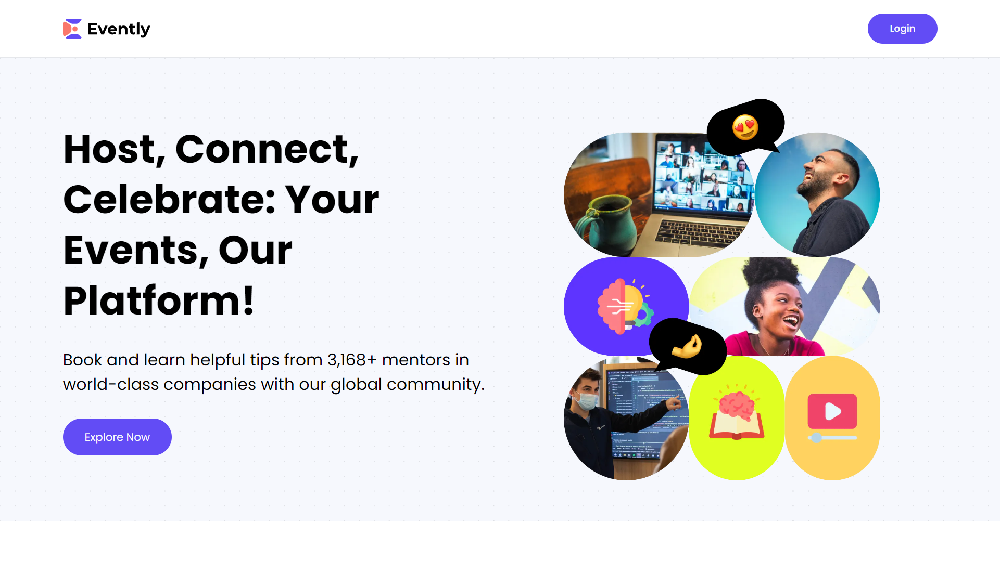

<div align="center">
    <a href="https://evently-fv.vercel.app" target="_blank">
      
    </a>
  <h3 align="center">Event Platform</h3>
</div>

##  <br /> 📋 <a name="table">Table of Contents</a>

- ✨ [Introduction](#introduction)
- ⚙️ [Tech Stack](#tech-stack)
- 📝 [Features](#features)
- 🚀 [Quick Start](#quick-start)

##  <br /> <a name="introduction">✨ Introduction</a>

**[EN]** Built on Next.js 14, the events application stands as a comprehensive, full-stack platform for managing events. It serves as a hub, spotlighting diverse events taking place globally. Featuring seamless payment processing through Stripe, you have the capability to purchase tickets for any event or even initiate and manage your own events.

**[FR]** Construite avec Next.js 14, cette application se présente comme une plateforme complète et évolutive pour la gestion des événements. Elle agit comme un hub mettant en lumière une diversité d'événements à travers le monde. Intégrant un traitement de paiement fluide via Stripe, elle vous permet d'acheter des billets pour n'importe quel événement ou même de créer et gérer vos propres événements.

##  <br /> <a name="tech-stack">⚙️ Tech Stack</a>

- **Next.js** is a React framework that enables server-side rendering (SSR), static site generation (SSG), and client-side rendering with built-in routing and webpack configuration. It's optimized for performance and SEO, making it ideal for building modern web applications.

- **Node.js:** A runtime environment that allows you to execute JavaScript code server-side. It's built on Chrome's V8 JavaScript engine and is widely used for building scalable network applications, APIs, and servers.

- **TypeScript:** A statically typed superset of JavaScript that enhances code quality and developer productivity. It provides type checking, interfaces, generics, and other advanced features that help catch errors early and improve tooling support.

- **Zod:** 

- **Stripe:** 

- **React Hook Form:** 

- **Tailwind:** A utility-first CSS framework that provides a set of pre-designed utility classes for styling web interfaces. It allows developers to build custom designs without writing traditional CSS by composing utility classes directly in HTML elements.

- **Shadcn:** 

- **Uploadthing:** 

## <br/> <a name="features">📝 Features</a>

👉 **Robust Authentication**: Secure and reliable user login and registration system.

👉 **Modern Home Page**: Showcases trending podcasts with a sticky podcast player for continuous listening.

👉 **Discover Podcasts Page**: Dedicated page for users to explore new and popular podcasts.

👉 **Fully Functional Search**: Allows users to find podcasts easily using various search criteria.

👉 **Create Podcast Page**: Enables podcast creation with text-to-audio conversion, AI image generation, and previews.

👉 **Multi Voice AI Functionality**: Supports multiple AI-generated voices for dynamic podcast creation.

👉 **Profile Page**: View all created podcasts with options to delete them.

👉 **Podcast Details Page**: Displays detailed information about each podcast, including creator details, number of listeners, and transcript.

👉 **Podcast Player**: Features backward/forward controls, as well as mute/unmute functionality for a seamless listening experience.

👉 **Responsive Design**: Fully functional and visually appealing across all devices and screen sizes.

and many more, including code architecture and reusability

## <br /> <a name="quick-start">🚀 Quick Start</a>

Follow these steps to set up the project locally on your machine.

**Dashboards**

- https://cloud.mongodb.com
- https://dashboard.clerk.com
- https://uploadthing.com/dashboard
- https://dashboard.stripe.com
- https://platform.openai.com

<br/>**Prerequisites**

Make sure you have the following installed on your machine:

- [Git](https://git-scm.com/)
- [Node.js](https://nodejs.org/en)
- [npm](https://www.npmjs.com/) (Node Package Manager)

<br/>**Cloning the Repository**

```bash
git clone {git remote URL}
```

<br/>**Installation**

Let's install the project dependencies, from your terminal, run:

```bash
npm install
# or
yarn install
```

**Set Up Environment Variables**

Create a new file named `.env` in the root of your project and add the following content:

```env
# Convex
CONVEX_DEPLOYMENT=
NEXT_PUBLIC_CONVEX_URL=

# Clerk
NEXT_PUBLIC_CLERK_PUBLISHABLE_KEY=
CLERK_SECRET_KEY=
CLERK_WEBHOOK_SECRET=
NEXT_PUBLIC_CLERK_SIGN_IN_URL='/sign-in'
NEXT_PUBLIC_CLERK_SIGN_UP_URL='/sign-up'

# OpenAI
OPENAI_API_KEY=
```

Replace the placeholder values with your actual credentials. 

<br/>**Running the Project**

Installation will take a minute or two, but once that's done, you should be able to run the following command:

```bash
npm run dev
# or
yarn dev
```

Open [`http://localhost:3000`](http://localhost:3000) in your browser to view the project.


**Dashboards**

- https://cloud.mongodb.com
- https://dashboard.clerk.com
- https://uploadthing.com/dashboard
- https://dashboard.stripe.com